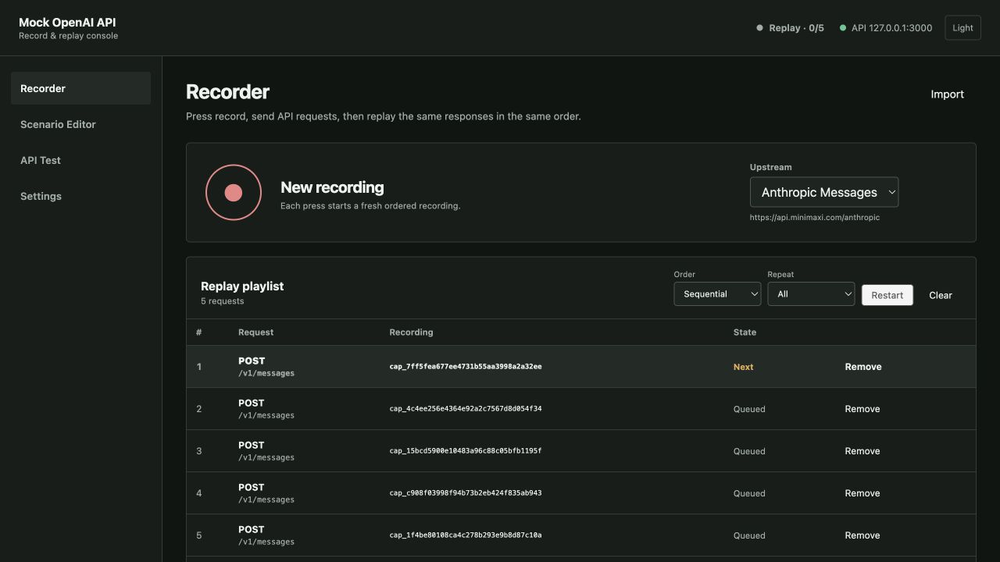

# Mock OpenAI API

[](https://www.npmjs.com/package/mock-openai-api)
[](https://hub.docker.com/r/zerob13/mock-openai-api)
[](https://hub.docker.com/r/zerob13/mock-openai-api)
[](https://github.com/zerob13/mock-openai-api/releases)
[](https://github.com/zerob13/mock-openai-api/blob/main/LICENSE)
[](https://www.typescriptlang.org/)
[](https://expressjs.com/)
[](https://www.docker.com/)
[](https://github.com/zerob13/mock-openai-api)
[](https://github.com/zerob13/mock-openai-api/fork)

*[中文说明](README.zh.md) | English*

A focused OpenAI and Anthropic API mock server that returns built-in or recorded test data without calling a real model in Replay mode.

## Record and replay console

The server now starts two listeners:

- Mock API: `http://127.0.0.1:3000`
- Admin console: `http://127.0.0.1:3001`

The Recorder is the primary workflow. Press Record to start a new ordered recording, send any number of requests, then press Stop. Each request remains an independent credential-redacted `.llmcap.jsonl` file, tagged with the recording ID and its position; completed and in-flight requests appear as live rows in the console. Recording can use any configured OpenAI Chat, OpenAI Responses, or Anthropic Messages upstream, and `GET /v1/models` follows the selected upstream.

Stopping automatically loads that recording for replay. Each incoming generation call atomically consumes the next recorded generation response without matching its method, path, body, model, or prompt. The sixth call to a five-generation-call recording returns `recording_exhausted`; pressing Replay rewinds the cursor. Model discovery does not consume that cursor: `GET /v1/models` replays the latest successful model-list capture in the recording, or falls back to the built-in list. Same-protocol responses retain their original bytes, chunks, headers, status, and relative timing. A generation response requested through another supported protocol is transcoded through the scenario compiler. Built-in examples and manually edited scenarios remain available as the fallback when no recording is loaded.



The built-in Web admin provides:

- **Recorder** — start and stop ordered recordings, inspect redacted requests and responses, import captures, and move captures to trash.
- **Replay playlist** — drag complete recordings or individual requests into a queue, reorder them, choose sequential or shuffled playback, and repeat one or all entries.
- **Scenario Editor** — create text, tool-call, usage, finish, error, and ping timelines, then validate and preview them as OpenAI Chat, OpenAI Responses, or Anthropic Messages output.
- **API Test** — send streaming or non-streaming requests, inspect raw responses, headers, SSE events, and browser chunk timing, and copy curl or SDK examples.
- **Settings** — configure an upstream for each protocol, run an explicit reachability check, allow private-network targets when needed, and enable or disable gateway endpoints.

The Web admin is bundled into both the npm package and Docker image. It supports desktop and mobile layouts plus light and dark themes. Admin access stays on loopback by default; exposing it requires an in-memory bearer token.

```bash
npm install
npm run build
npm start
```

Supported gateway endpoints are `POST /v1/chat/completions`, `POST /v1/responses`, `POST /v1/messages`, and `GET /v1/models`. Keep the client API key unchanged and point its base URL at this server. The full architecture, file schema, protocol mapping, security boundaries, and delivery plan are documented in [`docs/record-replay-implementation.md`](docs/record-replay-implementation.md).

## 🚀 Quick Start

### Method 1: Docker (Recommended for Local Development)

The easiest way to run Mock OpenAI API locally is using Docker from [Docker Hub](https://hub.docker.com/r/zerob13/mock-openai-api):

```bash
# Pull and run version 1.0.6
docker run -p 3000:3000 zerob13/mock-openai-api:1.0.6

# Run with custom port
docker run -p 8080:3000 zerob13/mock-openai-api:1.0.6

# Run with verbose logging
docker run -p 3000:3000 -e VERBOSE=true zerob13/mock-openai-api:1.0.6

# Run in background (detached mode)
docker run -d -p 3000:3000 --name mock-openai-api zerob13/mock-openai-api:1.0.6

# Run with timezone setting
docker run -p 3000:3000 -e TZ=Asia/Shanghai zerob13/mock-openai-api:1.0.6

# Expose the admin console safely (the token is never persisted)
docker run -p 3000:3000 -p 127.0.0.1:3001:3001 \
  -e ADMIN_HOST=0.0.0.0 -e ADMIN_TOKEN=change-this-token \
  -v mock-openai-data:/data zerob13/mock-openai-api:1.0.6
```

Available environment variables:
- `PORT`: Server port (default: 3000)
- `HOST`: Server host (default: 0.0.0.0)  
- `VERBOSE`: Enable verbose logging (default: false)
- `ADMIN_PORT`: Admin console port (default: 3001)
- `ADMIN_HOST`: Admin console host (default: 127.0.0.1)
- `ADMIN_TOKEN`: Admin API bearer token (never persisted); required whenever `ADMIN_HOST` is not loopback
- `DATA_DIR`: Capture and scenario directory (default: `.mock-openai-api`)
- `TZ`: Timezone setting (default: UTC)
- `NODE_ENV`: Node.js environment (default: production)

### Method 2: Docker Compose

The repository includes a Compose file that persists `/data` and exposes Admin only on host loopback. Set a token before starting it:

```bash
ADMIN_TOKEN=change-this-token docker compose up -d
```

### Method 3: NPM Installation

```bash
npm install -g mock-openai-api
```

### Start Server

```bash
npx mock-openai-api
```

The Mock API starts at `http://localhost:3000`; the Web admin starts at `http://127.0.0.1:3001`.

## ⚙️ CLI Options

The mock server supports various command line options for customization:

### Basic Usage

```bash
# Start with default settings
npx mock-openai-api

# Start on custom port
npx mock-openai-api -p 8080

# Start on custom host and port
npx mock-openai-api -H localhost -p 8080

# Enable verbose request logging
npx mock-openai-api -v

# Combine multiple options
npx mock-openai-api -p 8080 -H 127.0.0.1 -v
```

### Available Options

| Option             | Short | Description                       | Default   |
| ------------------ | ----- | --------------------------------- | --------- |
| `--port <number>`  | `-p`  | Server port                       | `3000`    |
| `--host <address>` | `-H`  | Server host address               | `0.0.0.0` |
| `--admin-port <number>` | | Admin console port | `3001` |
| `--admin-host <address>` | | Admin console host | `127.0.0.1` |
| `--admin-token <token>` | | Admin bearer token; required for non-loopback host | |
| `--data-dir <path>` | `-d` | Capture and scenario directory | `.mock-openai-api` |
| `--verbose`        | `-v`  | Enable request logging to console | `false`   |
| `--version`        |       | Show version number               |           |
| `--help`           |       | Show help information             |           |

### Examples

```bash
# Development setup with verbose logging
npx mock-openai-api -v -p 3001

# Production-like setup
npx mock-openai-api -H 0.0.0.0 -p 80

# Local testing setup
npx mock-openai-api -H localhost -p 8080 -v

# Check version
npx mock-openai-api --version

# Get help
npx mock-openai-api --help
```

When the server starts, it prints both listeners and the data directory:

```
Mock API: http://127.0.0.1:3000
Admin UI: http://127.0.0.1:3001
Data: /path/to/.mock-openai-api
```

### Basic Usage

```bash
# Get model list
curl http://localhost:3000/v1/models

# Chat completion (non-streaming)
curl -X POST http://localhost:3000/v1/chat/completions \
  -H "Content-Type: application/json" \
  -d '{
    "model": "mock-gpt-thinking",
    "messages": [{"role": "user", "content": "Hello"}]
  }'

# Chat completion (streaming)
curl -X POST http://localhost:3000/v1/chat/completions \
  -H "Content-Type: application/json" \
  -d '{
    "model": "mock-gpt-thinking",
    "messages": [{"role": "user", "content": "Hello"}],
    "stream": true
  }'

# Image generation
curl -X POST http://localhost:3000/v1/images/generations \
  -H "Content-Type: application/json" \
  -d '{
    "model": "gpt-4o-image",
    "prompt": "A cute orange cat",
    "n": 1,
    "size": "1024x1024"
  }'
```

## 🎯 Features

- ✅ **OpenAI Chat, OpenAI Responses, and Anthropic Messages gateway compatibility**
- ✅ **Support for streaming and non-streaming chat completions**
- ✅ **Function calling support**
- ✅ **Image generation support**
- ✅ **Predefined test scenarios**
- ✅ **Built-in Web admin for recording, replay playlists, scenario editing, and API testing**
- ✅ **Written in TypeScript**
- ✅ **Docker support with multi-arch images (AMD64/ARM64)**
- ✅ **Easy integration and deployment**
- ✅ **Detailed error handling**
- ✅ **Health check endpoint**

## 📋 Supported API Endpoints

### Model Management
- `GET /v1/models` - Get available model list
- `GET /models` - Compatible endpoint

### Chat Completions
- `POST /v1/chat/completions` - Create chat completion
- `POST /chat/completions` - Compatible endpoint

### Image Generation
- `POST /v1/images/generations` - Generate images
- `POST /images/generations` - Compatible endpoint

### Health Check
- `GET /health` - Server health status

## 🤖 Available Models

### 1. mock-gpt-thinking
**Thinking Model** - Shows reasoning process, perfect for debugging logic

```json
{
  "model": "mock-gpt-thinking",
  "messages": [{"role": "user", "content": "Calculate 2+2"}]
}
```

Response will include `<thinking>` tags showing the reasoning process.

### 2. gpt-4-mock
**Function Calling Model** - Supports tools and function calling

```json
{
  "model": "gpt-4-mock",
  "messages": [{"role": "user", "content": "What's the weather like in Beijing today?"}],
  "functions": [
    {
      "name": "get_weather",
      "description": "Get weather information",
      "parameters": {
        "type": "object",
        "properties": {
          "location": {"type": "string"},
          "date": {"type": "string"}
        }
      }
    }
  ]
}
```

### 3. mock-gpt-markdown
**Markdown Sample Model** - Outputs standard Markdown format plain text

```json
{
  "model": "mock-gpt-markdown",
  "messages": [{"role": "user", "content": "Any question"}]
}
```

Response will be a complete Markdown document with various formatting elements, perfect for frontend UI debugging.
**Note:** This model focuses on content display and doesn't support function calling to maintain output purity.

### 4. gpt-4o-image
**Image Generation Model** - Specialized for image generation

```json
{
  "model": "gpt-4o-image",
  "prompt": "A cute orange cat playing in sunlight",
  "n": 2,
  "size": "1024x1024",
  "quality": "hd"
}
```

Supports various sizes and quality settings, returns high-quality simulated images.

## 🛠️ Development

### Local Development

```bash
# Clone project
git clone https://github.com/zerob13/mock-openai-api.git
cd mock-openai-api

# Install dependencies
npm install

# Run in development mode
npm run dev

# Build project
npm run build

# Run in production mode
npm start
```

### Project Structure

```
src/
├── types/          # TypeScript type definitions
├── data/           # Predefined test data
├── utils/          # Utility functions
├── services/       # Business logic services
├── controllers/    # Route controllers
├── routes/         # Route definitions
├── app.ts          # Express app setup
├── index.ts        # Server startup
└── cli.ts          # CLI tool entry
```

### Adding New Test Scenarios

1. Add new test cases in `src/data/mockData.ts`
2. You can add test cases for existing models or create new model types
3. Rebuild the project: `npm run build`

Example:

```typescript
const newTestCase: MockTestCase = {
  name: "New Feature Test",
  description: "Description of new feature test",
  prompt: "trigger keyword",
  response: "Expected response content",
  streamChunks: ["chunked", "streaming", "content"], // optional
  functionCall: { // optional, only for function type models
    name: "function_name",
    arguments: { param: "value" }
  }
};
```

## 🌐 Deployment

### Docker Hub

Pre-built Docker images are available on Docker Hub and automatically updated with each release:

```bash
# Version 1.0.6
docker pull zerob13/mock-openai-api:1.0.6

# Rolling default-branch build
docker pull zerob13/mock-openai-api:latest

# Run the container
docker run -d -p 3000:3000 --name mock-openai-api zerob13/mock-openai-api:latest
```

### Build from Source

If you want to build the Docker image yourself:

```bash
# Clone the repository
git clone https://github.com/zerob13/mock-openai-api.git
cd mock-openai-api

# Build the image
docker build -t my-mock-openai-api .

# Run your custom build
docker run -p 3000:3000 my-mock-openai-api
```

### Environment Variables

- `NODE_ENV` - Node environment (default: production)
- `PORT` - Server port (default: 3000)
- `HOST` - Server host (default: 0.0.0.0)
- `ADMIN_PORT` - Admin console port (default: 3001)
- `ADMIN_HOST` - Admin listener (default: 127.0.0.1)
- `ADMIN_TOKEN` - Required bearer token when Admin is not bound to loopback
- `DATA_DIR` - Capture and scenario directory (default: `.mock-openai-api`)
- `VERBOSE` - Enable verbose logging (default: false)

## 🧪 Testing

### Testing with curl

```bash
# Test local service
curl http://localhost:3000/health
curl http://localhost:3000/v1/models

# Test thinking model
curl -X POST http://localhost:3000/v1/chat/completions \
  -H "Content-Type: application/json" \
  -d '{
    "model": "mock-gpt-thinking",
    "messages": [{"role": "user", "content": "Explain recursion"}]
  }'

# Test function calling
curl -X POST http://localhost:3000/v1/chat/completions \
  -H "Content-Type: application/json" \
  -d '{
    "model": "gpt-4-mock",
    "messages": [{"role": "user", "content": "What time is it now?"}]
  }'

# Test Markdown output
curl -X POST http://localhost:3000/v1/chat/completions \
  -H "Content-Type: application/json" \
  -d '{
    "model": "mock-gpt-markdown",
    "messages": [{"role": "user", "content": "Any content"}]
  }'

# Test streaming output
curl -X POST http://localhost:3000/v1/chat/completions \
  -H "Content-Type: application/json" \
  -d '{
    "model": "mock-gpt-thinking",
    "messages": [{"role": "user", "content": "Tell me a story"}],
    "stream": true
  }'

# Test image generation
curl -X POST http://localhost:3000/v1/images/generations \
  -H "Content-Type: application/json" \
  -d '{
    "model": "gpt-4o-image",
    "prompt": "A cute orange cat",
    "n": 2,
    "size": "1024x1024"
  }'
```

### Testing with OpenAI SDK

```javascript
import OpenAI from 'openai';

// Using the local deployment
const client = new OpenAI({
  baseURL: 'http://localhost:3000/v1',
  apiKey: 'mock-key' // can be any value
});

// Test chat completion
const completion = await client.chat.completions.create({
  model: 'mock-gpt-thinking',
  messages: [{ role: 'user', content: 'Hello' }]
});

console.log(completion.choices[0].message.content);

// Test streaming chat
const stream = await client.chat.completions.create({
  model: 'mock-gpt-thinking',
  messages: [{ role: 'user', content: 'Hello' }],
  stream: true
});

for await (const chunk of stream) {
  const content = chunk.choices[0]?.delta?.content || '';
  process.stdout.write(content);
}

// Test image generation
const image = await client.images.generate({
  model: 'gpt-4o-image',
  prompt: 'A cute orange cat',
  n: 1,
  size: '1024x1024'
});

console.log(image.data[0].url);
```

## 🤝 Contributing

Issues and Pull Requests are welcome!

1. Fork this project
2. Create a feature branch: `git checkout -b feature/AmazingFeature`
3. Commit your changes: `git commit -m 'Add some AmazingFeature'`
4. Push to the branch: `git push origin feature/AmazingFeature`
5. Submit a Pull Request

## 📄 License

This project is licensed under the MIT License. See the [LICENSE](LICENSE) file for details.

## 🔗 Related Links

- [OpenAI API Documentation](https://platform.openai.com/docs/api-reference)
- [Express.js](https://expressjs.com/)
- [TypeScript](https://www.typescriptlang.org/)

## 💡 Use Cases

- **Frontend Development**: Rapidly develop and test AI features without waiting for backend API
- **API Integration Testing**: Verify application integration with OpenAI API
- **Demos and Prototypes**: Create demos that don't depend on real AI services
- **Development Debugging**: Debug streaming responses, function calls, and other complex scenarios
- **Cost Control**: Avoid API call costs during development phase
- **Offline Development**: Develop AI applications without internet connection

## 🎉 Conclusion

Mock OpenAI API enables you to quickly and reliably develop and test AI applications without worrying about API quotas, network connections, or costs. Start your AI application development journey today!
